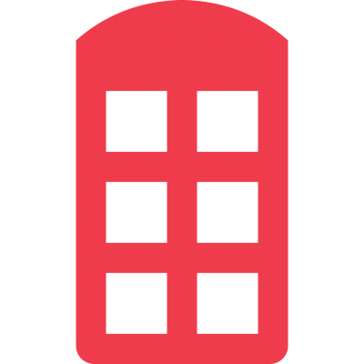

# Pre-Project 

## Index

- [Description of the problem](#problem)
- [Goal](#goal)
- [Architecture and Technology](#tech)
- [Sketch](#sketch)

### Description of the problem 

>Nota: Breve descripción.

### Goal 

- We target are create an app to ask about Star War's World, 
  so that anyone can find information about characters, naves, 
  movies, series, etc. 

### Architecture and Technology 

- We use the following architecture and technology:

  

### Sketch 

>Nota: Dibujo de la solución que se va a implementar.

